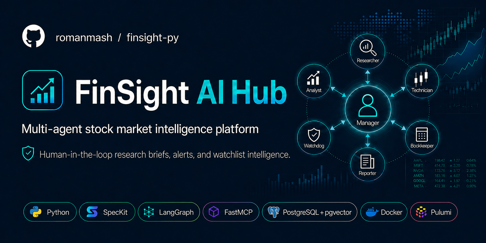

# FinSight AI Hub

Python-first multi-agent stock market intelligence platform for investor decision support.

<p align="center">
  
</p>

## Purpose

FinSight is designed for an investor who wants high-signal analysis without manually stitching together data from multiple terminals and feeds.

- Ingests market, news, and knowledge-base context through MCP tool servers
- Orchestrates specialist agents to produce structured briefs and alerts
- Delivers outputs through Telegram and a local Dash operator console
- Never executes trades; the investor remains the final decision maker

## How It Works

- A LangGraph supervisor graph orchestrates a 7-agent system and persists execution state with fault-tolerant PostgreSQL checkpointing. The specialist agents with each own responsibility are:
  - Manager (intent classifier, runs in supervisor flow)
  - Researcher (data collection)
  - Watchdog (threshold/alert scanning)
  - Analyst (thesis/risk reasoning)
  - Technician (technical pattern analysis)
  - Bookkeeper (knowledge-base writer, pgvector)
  - Reporter (final brief formatter)
  > `Screener` and `Trader` agents are planned but not fully implemented yet.
- Celery workers are runtime executors (not additional AI agent roles) and handle queues/schedules such as mission, alert, brief, watchdog, screener scans, telegram delivery, and planned trader-ticketing flows.
- Four FastMCP tool servers expose domain tools for market data (OpenBB), news and macro signals (Finnhub + GDELT), semantic retrieval (pgvector RAG), and AI-driven runtime diagnostics.
- A JWT-authenticated FastAPI backend coordinates synchronous APIs with asynchronous Celery + Redis pipelines for mission execution, alerts, and scheduled analysis jobs.
- User interaction runs through Telegram (text + voice via Whisper) and a Dash operator console; the system delivers structured briefs while the investor remains the final decision maker.
- Engineering discipline is built in: Spec-Driven Development (SpecKit), Everything-as-Code runtime config, provider-agnostic LLM abstraction with token/cost tracking, LangSmith + structlog observability, strict typing (`mypy`), offline-first tests (`pytest`), CI/CD (GitHub Actions), and IaC (Pulumi).

## Architecture Pitch

- High-level technical pitch (source): [`docs/pitch/PITCH.md`](docs/pitch/PITCH.md)
- Browser-ready rendered pitch (demo): [`docs/pitch/PITCH.html`](docs/pitch/PITCH.html)

## Tech Stack

- Core platform: `Python`, `uv`, `FastAPI`, `Pydantic`
- Agent system: `LangGraph`, `LangChain`, `FastMCP`, `LangSmith`
- Data and storage: `PostgreSQL`, `pgvector`, `SQLAlchemy`, `Alembic`, `Redis`, `Celery`
- Interfaces: `Telegram`, `Whisper`, `Dash`
- Delivery and quality: `Docker`, `Pulumi`, `GitHub Actions`, `pytest`, `mypy`

## Quick Start

```bash
# Prerequisites: Python 3.13, uv, Docker/Podman
uv sync
cp .env.example .env
uv run alembic upgrade head
uv run python -m api.seeds.seed
uv run pytest
```

See [CONTRIBUTING.md](CONTRIBUTING.md) for workflow, commit conventions, and PR checklist.

## Repository Structure

- `packages/shared/` - shared Python domain models
- `apps/api-service/` - FastAPI app, agents, workers
- `apps/mcp-servers/` - Python MCP servers
- `apps/dashboard/` - Dash operator console
- `apps/telegram-bot/` - python-telegram-bot app
- `config/runtime/` - YAML runtime config
- `config/schemas/` - Pydantic validation models
- `specs/` - feature specs and execution order

## Documentation

- [CHANGELOG.md](CHANGELOG.md) - release notes and version history
- [LICENSE](LICENSE) - MIT license terms
- [CONTRIBUTING.md](CONTRIBUTING.md) - contributor workflow, quality gates, and release process
- [docs/README.md](docs/README.md) - documentation map and boundaries
- [docs/CONTEXT.md](docs/CONTEXT.md) - architecture decisions and runtime constraints
- [docs/STACK.md](docs/STACK.md) - locked technology stack and rationale
- [specs/README.md](specs/README.md) - feature catalogue and spec execution order
- [AGENTS.md](AGENTS.md) - agent collaboration rules and constraints
- [.specify/memory/constitution.md](.specify/memory/constitution.md) - non-negotiable engineering principles
