# FinSight AI Hub — Technical Pitch

> A structured 10–15 minute architectural walkthrough for technical interviews.
> Covers design rationale, multi-agent architecture, data flows, human interactions,
> and engineering discipline behind every decision.

---

## 1. What It Is

**FinSight AI Hub** is a Python-first, multi-agent market intelligence platform
for a personal operator who monitors financial markets without wanting to babysit dashboards.

You send a voice message to Telegram: *"What's happening with NVDA?"*
Seven specialist AI agents coordinate behind the scenes — fetching live price data,
reading recent news, pulling past analysis from a knowledge base, reasoning over all
of it, and delivering a structured written brief back to your phone in under three minutes.

No trades are ever executed. FinSight is **decision support, not decision making**.
The human operator reads the analysis and decides what to do with it.

---

## 2. The Problem It Solves

Serious market research across a watchlist of 20–30 names means:

- Pulling OHLCV data, fundamentals, options flow, news, and macro signals — from different sources
- Synthesising them into a coherent thesis with confidence and risk factors
- Remembering what you thought last time and whether the thesis has changed
- Staying alert to sudden moves 24/7 without refreshing dashboards constantly

Doing this manually for even one ticker takes 20–30 minutes. Across a watchlist, it is a part-time job.

FinSight automates the data collection and reasoning pipeline. The operator's job becomes
reading the delivered brief and applying judgment — not assembling the raw inputs.

---

## 3. High-Level System Architecture

The system has four layers: the **human interface** (Telegram + Dash), the **API core**
(FastAPI + LangGraph orchestration), the **agent layer** (7 specialists), and the
**tool servers** (4 FastMCP microservices — 3 production data servers plus an opt-in
debug server that exposes the full runtime to AI-driven diagnosis).

Three human roles interact with the system. **Telegram auth** and **JWT auth** are
independent mechanisms: Telegram users are authenticated by a whitelist of Telegram IDs
in `telegram.yaml`; Dashboard users authenticate via JWT with roles `admin`, `viewer`,
or `service` (internal API-to-API).

- **Admin** — full access: Telegram + Dashboard with write actions
- **User** — Telegram only: whitelisted Telegram ID, no Dashboard access
- **Viewer** — Dashboard read-only: JWT viewer role, no Telegram access

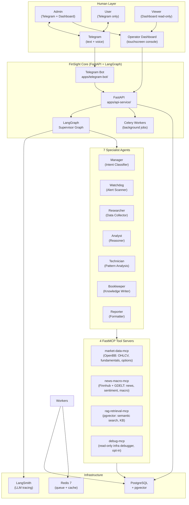

The key architectural decision is the **strict separation between agents and data**.
Agents never talk to OpenBB, Finnhub, or PostgreSQL directly — they call MCP tool
functions over HTTP. This means any data source can be swapped, upgraded, or mocked
without touching a single agent.

---

## 4. Three Real Interaction Scenarios

Before going into components, it helps to see three concrete scenarios that drive the design.

### Scenario A — On-Demand Investigation

The operator wonders about a specific ticker. They send a voice or text message to Telegram.

> *"What's the situation with TSLA? I saw some unusual options flow today."*

1. The Telegram Bot authenticates the message (only registered operators are served).
2. A mission is created in the database, Celery queues the pipeline.
3. The **Manager** classifies this as `investigation` and extracts ticker `TSLA`.
4. The **Researcher** fetches 4 parallel data streams: OHLCV bars, fundamentals, recent news, and any past KB entries about TSLA.
5. The **Analyst** reads the `ResearchPacket` and produces a typed `Assessment`: thesis, confidence score, list of risks, and what changed versus prior analysis.
6. The **Technician** agent runs technical analysis on the price history: support/resistance levels, chart patterns, momentum signals.
7. The **Bookkeeper** writes the Assessment to the vector knowledge base so future queries can recall it.
8. The **Reporter** formats everything into a readable Markdown brief and hands it back.
9. The bot pushes the brief to Telegram. Total elapsed: under 3 minutes.

The operator reads the brief and decides whether to act. FinSight never recommends buying or selling.

---

### Scenario B — Proactive Alert (No Operator Prompt)

The operator has NVDA on their watchlist with a `price_change_pct > 5%` threshold.
They are asleep. At 3am, NVDA gaps up 8% on an earnings surprise.

1. **Celery Beat** (the built-in Celery task scheduler, configured in `scheduler.yaml`) runs a scheduled `watchdog_scan` task every few minutes.
2. The **Watchdog Worker** calls the Watchdog Agent which checks all watchlist thresholds against live data from the `market-data-mcp`.
3. NVDA exceeds the threshold → an `AlertEvent` is emitted.
4. A new investigation mission is automatically enqueued — same pipeline as Scenario A.
5. The completed brief is pushed to Telegram.
6. The operator wakes up to a full NVDA analysis already waiting for them.

No polling. No notification spam. One well-reasoned brief, delivered once, with full context.

---

### Scenario C — Morning Daily Brief

Every morning at a configured time, Celery Beat fires the `daily_brief` task.

1. The **Brief Worker** fetches all active watchlist tickers from the database.
2. For each ticker, it enqueues a `daily_brief` mission.
3. Each mission runs the **Researcher → Analyst → Reporter** pipeline in the supervisor graph.
4. All completed briefs are aggregated into a single morning digest and pushed to Telegram.

The operator starts their day with a structured overview across their entire watchlist —
what moved, what the thesis is for each name, what risks to watch — without typing anything.

---

## 5. The 7 Agents — Strict Role Boundaries

Each agent has **exactly one responsibility**. This is not a convention — it is a
constitutional rule enforced during every code review. An agent that fetches data when
it should only reason, or formats output when it should only write to the KB, is a bug.

The **Manager** is special: it runs inside the supervisor node and classifies the
incoming query into a pipeline type. It never calls other agents directly — the supervisor
routes to the appropriate sequence based on the Manager's classification output.

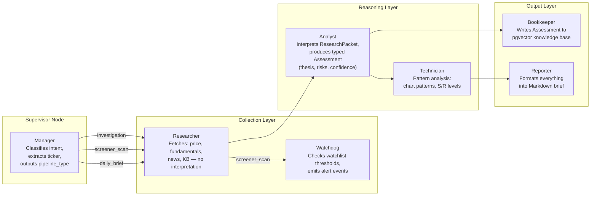

The boundary rule prevents a well-known LLM failure mode: when one model does everything
(fetch + reason + format), it hallucinates data it did not actually retrieve, interprets
things it should have passed through raw, and produces output that is impossible to audit.
By separating concerns, each agent's input and output are typed Pydantic models — fully
inspectable and logged for every mission.

| Agent | Input | Output | Must NOT |
|---|---|---|---|
| Manager | Natural language query | `pipeline_type` + ticker | Analyse anything |
| Researcher | Ticker symbol | `ResearchPacket` (4 data streams) | Interpret data |
| Watchdog | `ResearchPacket` + watchlist config | Alert events | Fetch market data independently |
| Analyst | `ResearchPacket` | `Assessment` (thesis, risks, confidence) | Fetch data |
| Technician | Price history from `ResearchPacket` | `PatternReport` | Make trade decisions |
| Bookkeeper | `Assessment` | pgvector KB entries | Format output |
| Reporter | `Assessment` + `PatternReport` | Markdown brief | Add new analysis |

---

## 6. The LangGraph Supervisor Graph

Each pipeline is a **LangGraph state machine**: a directed graph of agent nodes,
with a central supervisor that reads the current state and decides which node runs next.

The graph state is a TypedDict threaded through every node:
```
mission_id, query, pipeline_type, ticker,
research_packet, assessment, pattern_report, formatted_report,
error, completed_nodes
```

Each agent node reads what it needs, adds its output, appends itself to `completed_nodes`,
and returns control to the supervisor. The supervisor picks the next node based on which
agents have already run. This makes the flow explicit and auditable — there is no hidden
magic in how agents chain together.

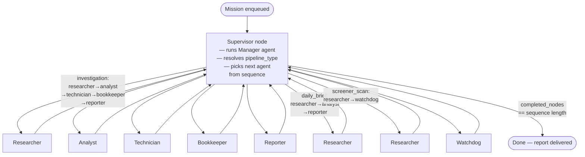

Every agent node returns control to the supervisor after completing. The supervisor
checks `completed_nodes` against the current pipeline's sequence and picks the next
agent — or terminates if the sequence is finished. There are no direct agent-to-agent
edges; all routing goes through the supervisor.

### Checkpoint & Recovery

After every agent step, LangGraph checkpoints the full graph state to PostgreSQL.
If a Celery worker crashes mid-pipeline — say, after the Analyst finishes but before the
Technician runs — the mission resumes from where it stopped on the next retry.
No work is duplicated. No data is lost.

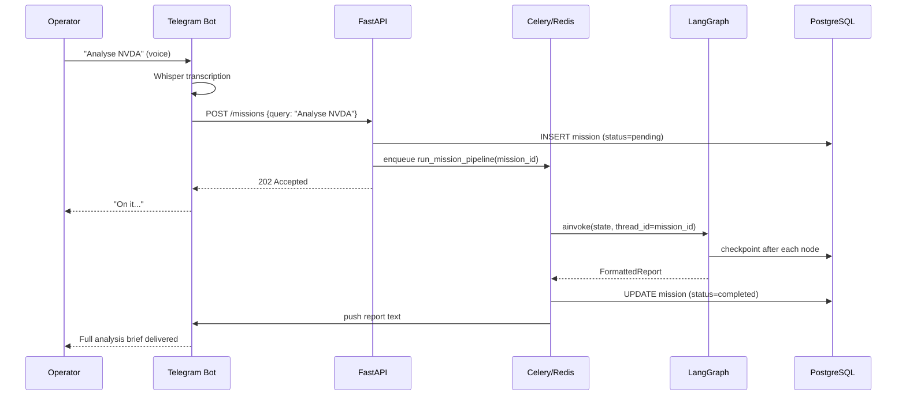

---

## 7. The FastMCP Tool Servers

Agents never call OpenBB, Finnhub, or pgvector directly. All external data access
goes through **independently deployed FastMCP microservices**. There are three
production data servers and one opt-in debug server (covered in detail in section 17).

Each server exposes a small, typed set of tools over **HTTP on the internal Docker
network** (`http://market-data-mcp:8001`, etc.). This is standard practice for
service-to-service communication inside a private Compose network — TLS termination
happens at the public edge, not between containers. Agents call these tools via an MCP
client — a thin protocol layer that routes by tool-name prefix (`market.*`, `news.*`,
`knowledge.*`). The agents do not know or care what is running behind each tool.
They call `get_ohlcv("NVDA", "1mo")` and receive typed data.

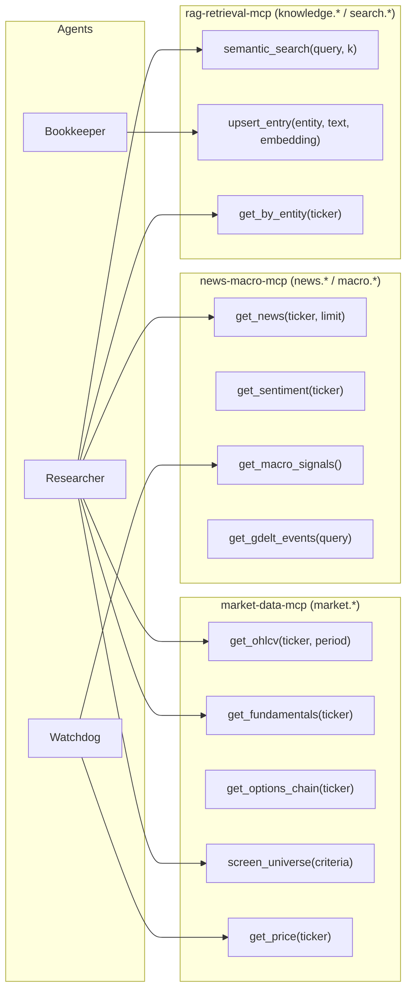

**Practical consequences of this architecture:**

- The `market-data-mcp` can be restarted, upgraded, or replaced without touching any agent.
  Swap OpenBB for a Bloomberg terminal adapter? Change one server. Zero agent code changes.
- In tests, the MCP client is mocked with `respx`. All agent tests run fully offline — no
  API keys, no network, no real market data required.
- Each server can be scaled independently. If news fetching is slow, scale `news-macro-mcp`
  horizontally without touching the others.

---

## 8. The Growing Knowledge Base

Every time the Analyst produces an Assessment, the **Bookkeeper** writes it to a
**pgvector** knowledge base — a PostgreSQL table with an embedding column.

This means FinSight learns over time. The next time NVDA is investigated:

1. The Researcher calls `semantic_search("NVDA thesis Q1 2026")` on the KB.
2. Past assessments, confidence scores, and identified risks are returned as context.
3. The Analyst can reason about *what changed* — not just what the data shows today,
   but how it compares to previous analysis.

This creates a compounding advantage: the longer the system runs, the richer the context
available to every new investigation. A fresh query on a ticker that has been analysed
10 times before gets 10 prior snapshots as additional signal.

---

## 9. Data Model — Core Domain Types

All domain types are defined once in `packages/shared/` and imported by agents,
workers, routes, and tests alike. There is no type duplication across services.
Every agent hand-off is a typed Pydantic model — not a dict, not a raw string.

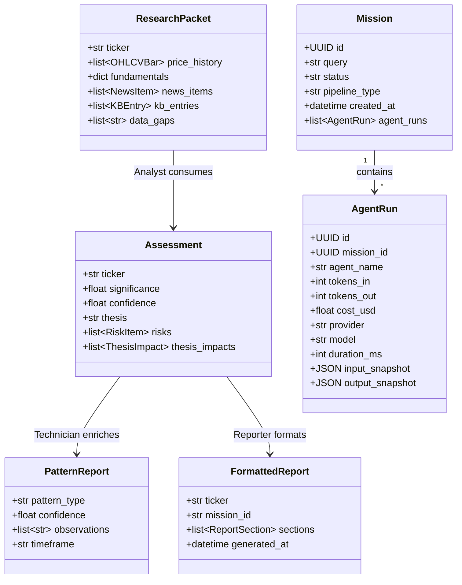

The `data_gaps` field on `ResearchPacket` is worth calling out: if the news API is down
or returns nothing, the Researcher records `"news_items: unavailable"` rather than failing.
The Analyst sees the gap and adjusts its confidence accordingly. Partial data produces a
lower-confidence analysis — not a crash.

---

## 10. Everything-as-Code Configuration

No behavior is hardcoded. Every threshold, model name, schedule, and parameter
lives in `config/runtime/*.yaml`. Pydantic v2 validates all files at startup.
A misconfigured YAML triggers `sys.exit(1)` with the exact schema error path —
never a silent failure at runtime hours later.

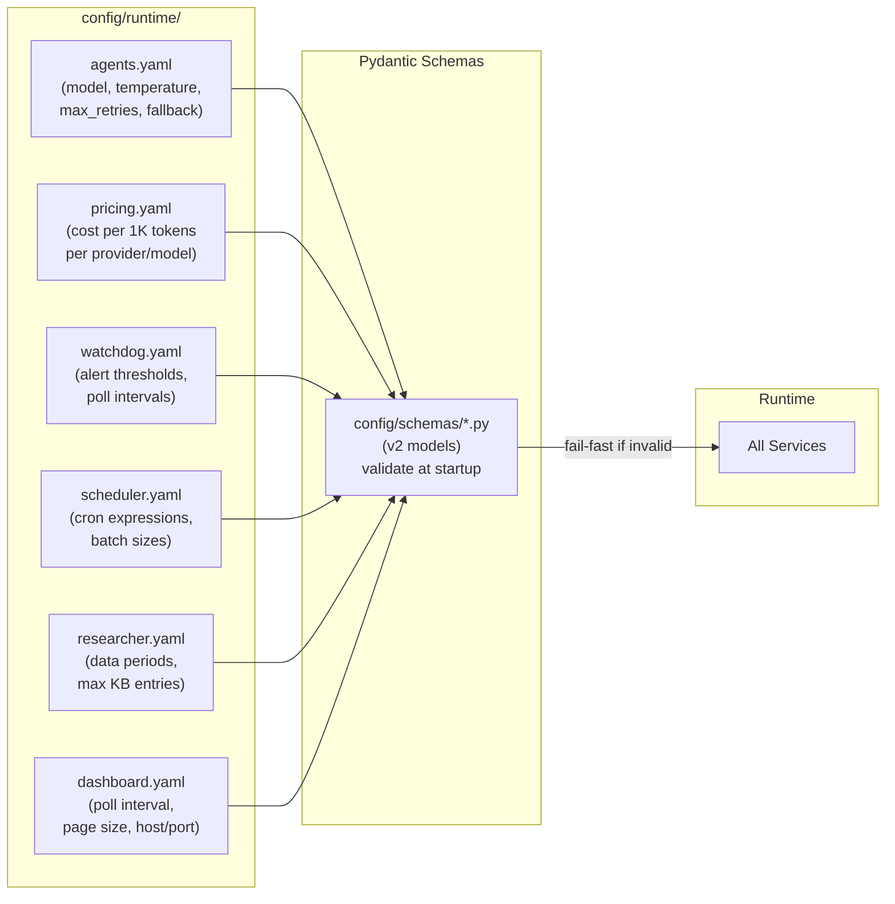

**Concrete examples of what this enables without code changes:**

- Change the LLM model for all agents from `claude-3-5-sonnet` to `gpt-4o` → edit one line in `agents.yaml`, restart.
- Tighten NVDA's alert threshold from `5%` to `3%` → edit `watchdog.yaml`, restart.
- Change the daily brief cron from `07:00` to `06:30` → edit `scheduler.yaml`, restart.
- Add a new LLM provider's pricing → add an entry to `pricing.yaml`, restart.

The system also supports a **fallback LLM provider** configured in `agents.yaml`.
If the primary LLM endpoint is unavailable, the agent retries on the fallback
provider automatically — the operator sees a slightly higher cost, not a failed mission.

---

## 11. Cost Observability

Running nine LLM agents per mission means cost can spiral invisibly without discipline.
Every single LLM call in FinSight produces an `AgentRun` record with full token accounting.

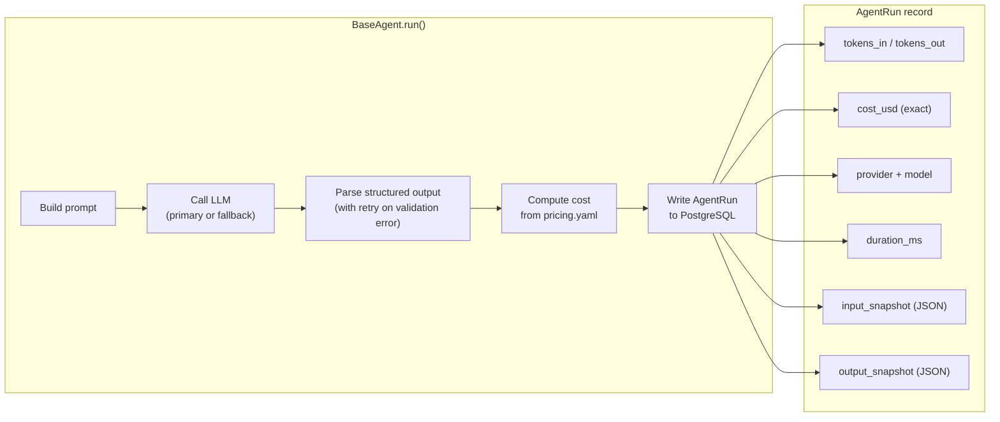

The cost model is explicit: `pricing.yaml` maps `(provider, model)` → cost per 1K tokens.
The `BaseAgent` multiplies actual token counts by the config rate and writes `cost_usd`
to the `AgentRun` record. This means:

- The operator can see the exact USD cost of every mission in the dashboard.
- If a new model is used that is not in `pricing.yaml`, the system records `$0.00`
  with a warning — it never blocks execution over a missing price entry.
- Per-mission cost breakdowns show which agent is the most expensive, enabling
  targeted optimisation (e.g., switching the Researcher to a cheaper model since
  it is doing retrieval, not reasoning).

---

## 12. Human in the Loop

FinSight is an **augmentation tool, not an autonomous actor**. The system never
makes decisions, never places orders, and never takes action on the operator's behalf.
Its only output is structured analysis delivered to a human who then decides.

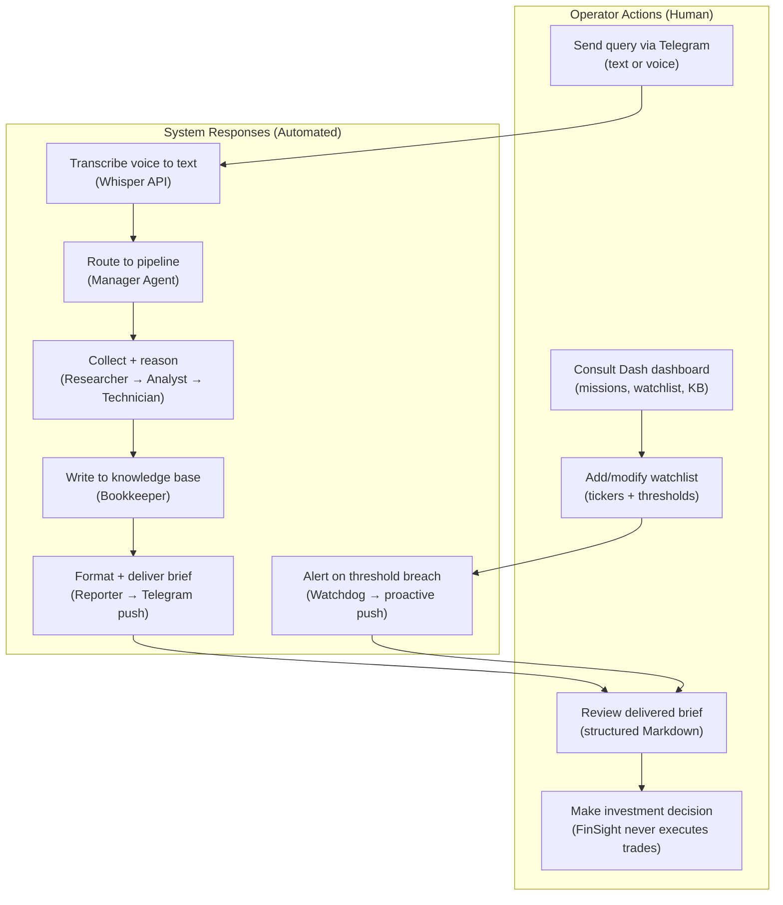

The human touch-points are deliberately minimal:
- **Telegram**: the operator sends a natural language query and receives a brief. No forms, no UI.
- **Watchlist management**: the operator defines which tickers to monitor and at what thresholds via the Dashboard. The system handles everything else.
- **Decision**: only the operator can act on the analysis. There is no "execute" button.

This design is intentional. The system is most useful when it runs silently in the background,
surfacing signal only when something is worth the operator's attention.

### Proactive Alerts — The Watchdog Loop

The most powerful human-in-the-loop pattern in FinSight is the one that requires
the least human action: **proactive alerts with zero polling**.

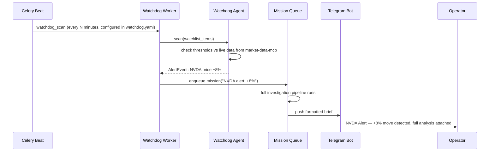

The interval, the thresholds, and which tickers trigger which pipelines are all
driven by `watchdog.yaml`. The operator configures the rules once; the system
watches around the clock.

---

## 13. Telegram Bot Interface

Telegram is the primary interface because it is always in the operator's pocket,
supports voice messages natively, and handles message delivery reliably.

**Text query flow:**
1. Operator types: *"Is MSFT still a buy after today's drop?"*
2. Auth check: is this Telegram user ID in the registered operators list? If not, silently ignore.
3. `POST /missions` with the query text. API responds `202 Accepted` immediately.
4. Bot sends: *"On it..."* — the operator knows their request was received.
5. Pipeline runs asynchronously. When done, the bot pushes the full brief.
6. If the brief exceeds Telegram's 4096-character limit, the bot splits it into numbered parts.

**Voice message flow:**
1. Operator holds the microphone button in Telegram and speaks their query.
2. Bot downloads the OGG audio file, sends to Whisper API for transcription.
3. Transcribed text enters the same flow as a typed query from step 3 above.
4. Ack message is sent within 10 seconds of receiving the voice note.

**Slash commands:**
- `/missions` — list the 5 most recent missions with status and cost
- `/brief` — trigger today's daily brief immediately, without waiting for the schedule
- `/help` — list available commands

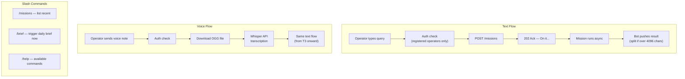

**Security note**: unregistered users are silently ignored — the bot sends no response,
no error, nothing. The operator's bot is not enumerable by strangers.

---

## 14. Operator Dashboard (Dash)

The Telegram bot is for mobile, on-the-go interaction. The **Dash dashboard** is for
the operator sitting at their desk who wants a visual overview — a screen that can stay
open on a touchscreen monitor running all day.

The dashboard consumes the same FastAPI it was built on. It has no direct database access —
every page renders data fetched from API endpoints, which means the same auth and
role-based access control applies everywhere.

**5 pages and what each answers:**

| Route | Page | Purpose | Key Interactions |
|---|---|---|---|
| `/` | **Overview** | What is happening right now? | Active missions, watchlist status, recent alerts, activity feed |
| `/missions` | **Missions** | What did the agents actually conclude? | Full reasoning chain, per-agent outputs, token costs, any errors |
| `/watchlist` | **Watchlist** | What am I monitoring and at what thresholds? | Add ticker, set alert conditions, enable/disable entries |
| `/kb` | **KB** | What has FinSight learned about a company? | Semantic search by entity, past assessments with confidence and freshness |
| `/health` | **Health** | Is the system healthy right now? | API ping, agent availability, MCP server status |

**Design constraints applied across all pages:**
- **48px touch targets** — the dashboard runs on a touchscreen monitor, not just a desktop browser
- **`dcc.Interval` polling** — no WebSocket complexity; pages refresh on a configured interval
- **No direct DB access** — all data fetched from FastAPI endpoints (same auth and RBAC as the API)
- **Structured error panels** — if the API is unreachable, pages show a clear error panel rather than crashing
- **Role-gated actions** — admin-only write actions (e.g., adding watchlist entries) are hidden from the viewer role

The Missions page is particularly useful for trust-building: it shows exactly which
agent produced what output, what data was available, what gaps were flagged, and how much
it cost. There are no black boxes — every step of the reasoning chain is inspectable.

---

## 15. Spec-Driven Development

FinSight is built using a strict **Specify → Plan → Implement** workflow.
No feature is written before its spec exists. No file is created that is not
listed in the plan. This is enforced by convention and code review.

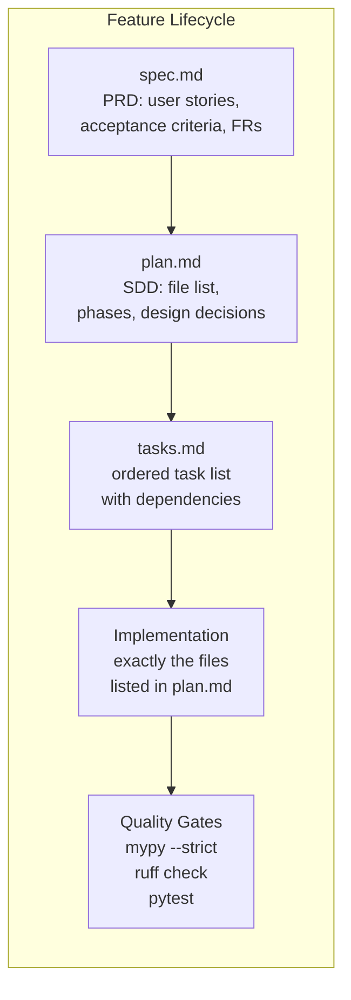

Each feature starts with a `spec.md` — a PRD with user stories, functional requirements,
and acceptance criteria. The `plan.md` then turns this into a technical design: which files
to create, what each does, what data model changes are needed, and what the phases are.
Only after the plan is agreed does implementation begin.

The **SpecKit** toolset automates this workflow. Running `/speckit.plan` generates a
structured plan from the spec. Running `/speckit.implement` executes the tasks in order.
Each task is marked complete as it finishes. Nothing is batched — if the process stops,
the next run picks up from the last completed task.

**The result**: 12 features fully implemented, each with a complete paper trail from spec → plan → tasks → tested code.

### 12-Feature Build Order

| # | Feature | Status |
|---|---|---|
| 001 | Python Foundation & Config | ✅ Complete |
| 002 | Async Data Layer (SQLAlchemy + Alembic) | ✅ Complete |
| 003 | API & JWT Auth | ✅ Complete |
| 004 | MCP Platform (3 tool servers) | ✅ Complete |
| 005 | Agent Infrastructure (BaseAgent + LangGraph) | ✅ Complete |
| 006 | Collector Agents (Watchdog, Researcher) | ✅ Complete |
| 007 | Reasoning Agents (Analyst, Technician, Reporter, Bookkeeper) | ✅ Complete |
| 008 | Orchestration (Supervisor graph + Celery workers) | ✅ Complete |
| 009 | Telegram Bot + Voice (Whisper integration) | ✅ Complete |
| 010 | Operator Dashboard (Dash) | ✅ Complete |
| 011 | Seed & Infrastructure (Pulumi IaC) | ✅ Complete |
| 012 | Debug MCP Server (agentic infrastructure debugger) | ✅ Complete |

---

## 16. Quality Engineering

### Offline-First Testing

Every test in the repo runs with no network access, no Docker, and no running LLM server.
This is a hard constraint, not a preference — it means any developer can run the full
test suite immediately after cloning, with `uv sync && uv run pytest`.

External calls are mocked at two levels:
- **HTTP layer** (MCP servers, LLM endpoints, Whisper): `respx` intercepts all `httpx` calls
  and returns fixture data.
- **Database layer**: tests use an in-memory SQLite instance via async pytest fixtures.
- **Celery tasks**: run synchronously in `task_always_eager` mode — no broker required.

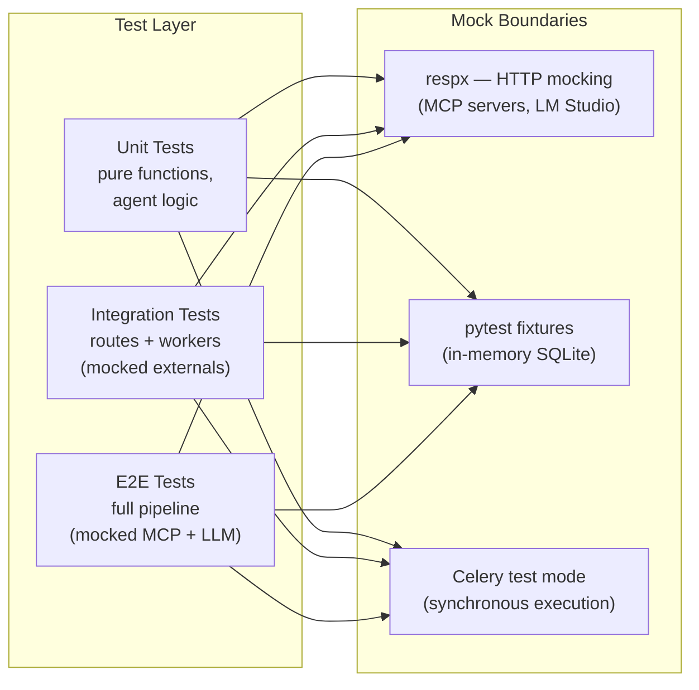

### Type Safety Pipeline

`mypy --strict` runs on the entire codebase. Zero errors is the gate. Explicitly:
- Every function has a return type annotation.
- No untyped `Any` is permitted.
- All domain types come from `packages/shared/` — no inline `dict` passing between agents.

```
uv run mypy --strict   →  zero errors (enforced in CI)
uv run ruff check      →  zero warnings
uv run pytest          →  all tests pass offline
uv run alembic check   →  no pending migrations
```

---

## 17. Debug MCP Server — Agentic Debugging Infrastructure

Most production multi-agent systems have a visibility problem: when something breaks
inside a running pipeline, diagnosing it means SSH-ing into a server, running raw SQL,
grepping logs, and manually inspecting Redis keys — none of which a coding agent can do
without a shell.

Feature 012 solves this by adding a **fourth MCP server exclusively for debugging**.
It exposes a typed, secure, read-only HTTP tool surface over the entire FinSight runtime —
so an AI coding agent (or the operator) can diagnose any failure through structured tool
calls, with no shell access required.

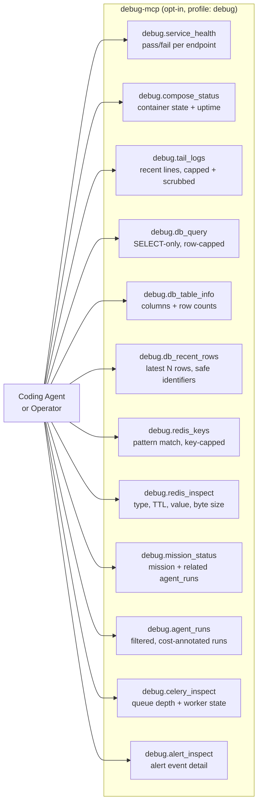

### What makes it production-safe

- **Bearer auth**: when `DEBUG_MCP_TOKEN` is set, every `POST /mcp/` call must carry a
  valid token. Unauthenticated requests get HTTP 401.
- **SQL read-only enforcement**: `debug.db_query` strips comments and rejects any SQL that
  does not begin with `SELECT`. No UPDATE, DELETE, DROP — the rejection happens before any
  DB connection is made.
- **Redis read-only**: only `GET`, `KEYS`, `TYPE`, `TTL`, `LRANGE`, `HGETALL`, `SMEMBERS`,
  `ZRANGE`. No write commands exposed.
- **Secret scrubbing**: `debug.tail_logs` applies a regex to every returned line,
  redacting values that match known secret patterns (env-style `KEY=value`, JWT fragments).
- **Output caps**: logs 1000 lines · DB rows 500 · Redis keys 200 · agent runs 100.
  Every capped response includes `capped: true` in the typed envelope.
- **Opt-in only**: the service runs only under the `debug` Docker Compose profile.
  It is never started in a standard production deployment.
- **DB privilege separation**: a DB migration creates a `debug_reader` Postgres role with
  `SELECT`-only grants and default privileges. The server connects as that role.

### The debugging workflow for a coding agent

When a mission fails or behaves unexpectedly, an agent can run a complete diagnosis
using only MCP tool calls:

1. `debug.service_health` — are all services reachable?
2. `debug.compose_status` — are all containers running?
3. `debug.mission_status(mission_id)` — what is the mission state and which agents ran?
4. `debug.agent_runs(mission_id)` — which agent failed, with what input/output?
5. `debug.tail_logs("api-service", lines=100)` — what did the API log around that time?
6. `debug.db_query("SELECT * FROM missions WHERE id = ...")` — confirm DB state directly.
7. `debug.redis_inspect("celery-task-meta-...")` — check Celery task result in Redis.

This covers the full diagnostic surface without a terminal, without SSH, and without
human intervention to retrieve log snippets.

### MCP client registration

The server is registered in two IDE-facing MCP config files:
- `.vscode/mcp.json`: `debug-infra` (HTTP transport, `http://localhost:8010/mcp/`)
  and `debug-browser` (`mcp/playwright` via Docker stdio, for browser-based debugging).
- `.claude/settings.json`: same entries, so Claude Code sessions can use both servers.

The `debug-browser` entry uses the `finsight_default` Docker network, which is
deterministically named from `COMPOSE_PROJECT_NAME=finsight` in `.env`.

---

## 18. Technology Stack

| Layer | Technology | Why This Choice |
|---|---|---|
| Runtime | Python 3.13 | Learning goal; enterprise AI engineering standard |
| Monorepo | uv workspaces | Fast, deterministic dependency resolution |
| API | FastAPI | Async-native, auto OpenAPI docs, dominant Python API framework |
| ORM | SQLAlchemy 2.x async + Alembic | Type-safe, async, industry-standard migrations |
| Vector DB | PostgreSQL + pgvector | Single DB for relational + vector — no extra infra |
| Queue | Celery + Redis 7 | Enterprise-standard Python task queue |
| Agent Orchestration | LangGraph | Stateful supervisor graph; `StateGraph` + PostgreSQL checkpointing |
| LLM Abstraction | LangChain Core (`langchain-anthropic`, `langchain-openai`) | Provider-agnostic `BaseChatModel`; swap LLM with one config change |
| Tool Protocol | FastMCP | Lightweight MCP microservices; agents decouple from data sources |
| Finance Data | OpenBB Platform SDK | Unified Python API for stocks, ETFs, macro, news |
| RAG / Vector Search | pgvector (direct SQL) | Semantic search via `<=>` cosine distance in PostgreSQL; no LangChain in the retrieval path |
| Bot | python-telegram-bot v20 async | Mature async SDK; voice via Whisper API |
| Dashboard | Dash (Plotly) | Python-native operator console; touchscreen-ready |
| LLM Observability | LangSmith + structlog | Per-call traces + structured JSON logs |
| Config | Pydantic v2 + YAML | Schema-validated, fail-fast, everything-as-code |
| IaC | Pulumi Python | Python-native infrastructure; same language as application |
| Testing | pytest + respx + pytest-asyncio | Full offline test suite |

---

## 19. Deployment Topology

Development happens on Windows 11 with Podman. Production runs on an Ubuntu 24.04 server
via Docker Compose. A single `scripts/deploy.sh` rsyncs the codebase over SSH and restarts
services. No CI/CD pipeline is required for a single-operator personal deployment.

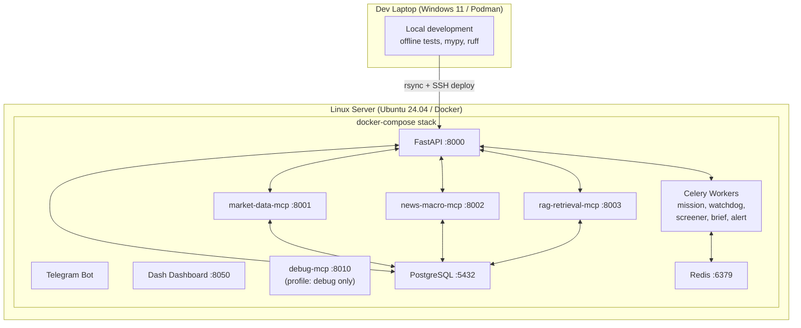

Config volumes are mounted `:ro` in containers — behavioral config is immutable at runtime.
Secrets live only in `.env` on the server — never in source control, never in container images.

---

## 20. Security Model

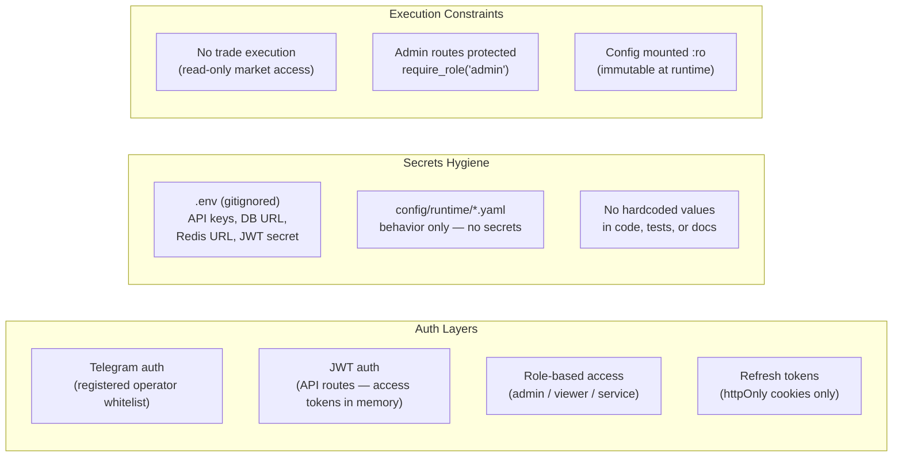

Three things worth highlighting:

1. **JWT tokens live in memory only** — never in localStorage, never in a cookie that is readable by JavaScript. Refresh tokens use httpOnly cookies.
2. **No secrets in code** — API keys, database URLs, and JWT secrets exist only in `.env` on the server. The `config/runtime/` YAML files contain behavior, never credentials.
3. **No trade execution anywhere** — there is no code path in the system that can place an order. The data connections are read-only by design.

---

## 21. Key Design Principles (Constitution)

The project is governed by a **ratified constitution** (v2.0.0, 2026-03-28).
Every architectural decision is traceable to one of seven core principles:

| Principle | What It Means in Practice |
|---|---|
| **Everything-as-Code** | All behavior in YAML — no magic numbers, no hardcoded thresholds |
| **Agent Boundaries** | Each agent has one job; crossing boundaries is a constitutional violation |
| **MCP Independence** | Tool servers are self-contained microservices; agents use them via protocol |
| **Cost Observability** | Every LLM call produces an `AgentRun` record with full cost accounting |
| **Fail-Safe Defaults** | Invalid config → `sys.exit(1)`; unknown model → `$0.00` warning, never block |
| **Test-First** | All tests must pass offline; no network, no Docker, no external services |
| **Simplicity Over Cleverness** | FastAPI, LangGraph, Celery — proven tools, not experimental frameworks |

The constitution is versioned and amended formally with a ratification date.
It is the first document read before any implementation work begins.

---

## 22. What This Demonstrates

| Capability | Evidence |
|---|---|
| **Multi-agent system design** | 7 agents with strict boundaries, typed I/O, LangGraph supervisor graph |
| **Production Python engineering** | mypy strict, ruff, pytest, uv workspaces, Pydantic v2 |
| **Async architecture** | FastAPI + SQLAlchemy 2.x async + python-telegram-bot v20 async |
| **Background job orchestration** | Celery + Redis, 5 worker types, cron scheduling via Beat |
| **LLM cost awareness** | Token + cost tracking on every call, per-provider pricing config |
| **RAG / vector search** | pgvector direct SQL (`<=>` cosine distance); OpenAI embeddings; no LangChain in retrieval path |
| **Fault tolerance** | LangGraph checkpointing, Celery retries, fallback LLM providers |
| **Configuration discipline** | Pydantic-validated YAML, fail-fast startup, no hardcoded behavior |
| **Security hygiene** | JWT, role-based access, httpOnly cookies, secrets only in .env |
| **Spec-driven development** | 12 features, each with spec.md → plan.md → tasks.md → implementation |
| **Agentic debugging infrastructure** | Debug MCP Server: typed, read-only, auth-gated, secret-scrubbing tool surface for AI-driven diagnosis |
| **Human-in-the-loop design** | System augments operator judgment; never makes autonomous decisions |
| **Multimodal input** | Text + voice (Whisper transcription) via Telegram |
